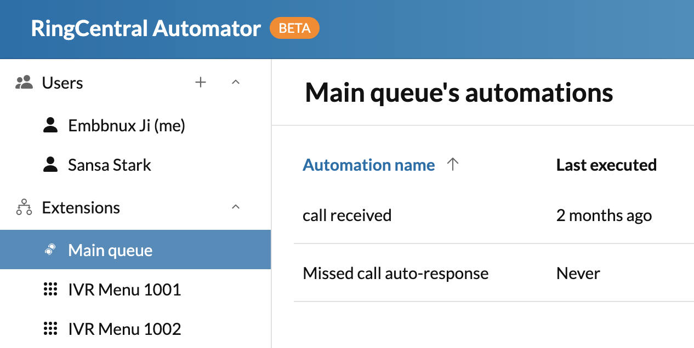
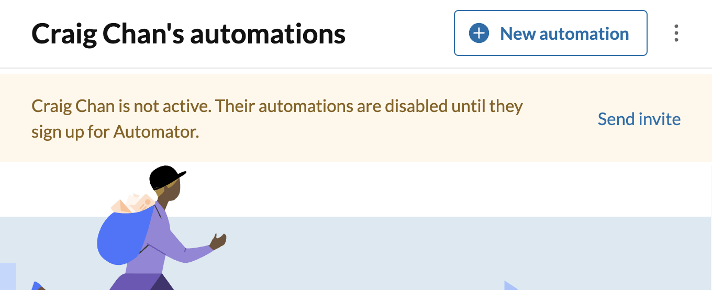

# Administrator's guide to RingCentral Automator

RingCentral Automator allows administrators to perform a number of operations that a regular cannot, including:

* Managing automations on behalf of other users
* Managing automations on behalf of call queues, and other extensions
* Modifying on whose behalf an automation is run (which can affect the phone numbers one can send SMS from for example)
* Coping automations to another user's account

## How to become an Automator administrator

There are two ways to become an Automator administrator.

1. Have some assigned the Operator
2. Be assigned the “Super Admin” role in the [Admin console](https://service.ringcentral.com/).

Super Admins will have the ability to manage the following 
extension types:

* User
* Call Queue
* Voicemail
* Park Location
* IvrMenu

Auto-receptionists will have the ability to manage the following extension types:

* Call Queue
* Park Location
* IvrMenu

## Managing automations for extensions

1. the left-hand navigation, open "Extensions" section, and select extension
2. Create and edit automations for the selected extension

!!! info "For IvrMenu extensions, only the [call received](../custom-workflows/triggers/call-received/) and [call ended](../custom-workflows/triggers/call-ended/) triggers are supported. The [missed call event](../custom-workflows/triggers/call-missed/) is not supported for IvrMenu." 

## Managing automations for users

1. the left-hand navigation, click the “+” (plus sign) next to “Users.”
   

2. Search for the name, phone number or extension in the dialog that appears.
   

3. Click “Add”.

This will add the user to your list of users whose automations you manage. Now select the user to view their automations.

Create and edit automations for that user as you would for any other user.

!!! info "When managing automations on behalf of another user, those automations cannot be enabled until that user has logged into Automator."

## Modifying the runner of an automation

RingCentral Automator allows for admins to create automations on behalf of others. These automations, or any automation for that matter, distinguishes between two key roles related to each automation. They are:

* **Owner**. The owner of the automation determines under which user or extension the automation is listed. This helps primarily with the organization and categorization of automations. 

* **Runner**. The runner of the automation is the identity through which the automation is executed. This primariy affects the audit trail within RingCentral. For example, let's say there is an automation that sends an SMS. If that automation is executed using Jane's identity, then the audit trail will show that Jane sent the SMS messages triggered by that automation. 

Automator allows only Super Admins to modify the runner of an automation associated with a user in their account. This is done either by editing the automation template, or by editing the trigger associated with an advanced workflow. 

Admins can set the runner of an automation according to the following constraints:

* Extensions of type User can be run on behalf of any Super Admin or the automation's owner. 
* Extensions of type Call Queue, Voicemail and Park Location can be run on behalf of any Super Admin or the Operator extension. 

The runner of an automation can only be assigned to accounts that have been activated by someone logging into that account. 

## Inviting a user to Automator

In order for any automation to be run, the owner of the automation must have a fully-activated account inside of Automator. To activate an account, a user only needs to login and authorize Automator. Until such time, any automations created for a user will remain dormant, and a message will be displayed to users of Automator alerting them to this fact. 

<figure markdown>
  
  <figcaption>Automations remain dormant until users login to Automator. Resend invites quickly to enable automations.</figcaption>
</figure>

When an administrator adds another user to the list of users they manage automations for, that user will automatically receive an email inviting them to login to Automator. 

## Copying automations

Any user can make a copy of an automation within their list of automations. Admins have the exclusive ability to copy automations to another user's account. This ability is useful when needing to deploy the same automation in a standardized way to a relatively large number of accounts or extensions. 

<figure markdown>
  
  <figcaption>Replicate automations across your account</figcaption>
</figure>

## Managing automations for call queues and other extension types

For Call Queue, Voicemail, IvrMenu and Park Location extension types, automations are run on behalf of the person who created the automation by default. In other words, if you were to inspect your company’s audit trail, the creator of the automation would be seen as the user who performed the actions within the automation. Administrators can specify another user to run an automation on behalf of. This may give one automation access to features and phone numbers they might otherwise not have access to.

