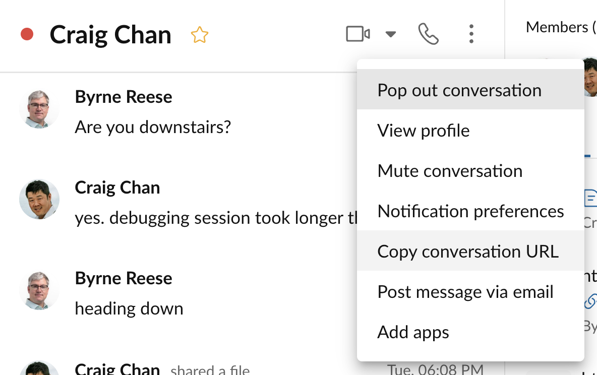

# Action: send chat message

Sends a chat message to a team, group or person via RingCentral's unified messaging application. 

When selecting the chat you want to post your message to, you may observe that not all chats can be found in the select menu, especially if that team was added recently. In this circumstance, logout of Automator and then log back in so that you can force the list of teams to be updated. In the future, the ability to refresh the list of teams without logging out will be added. 

### Specifying a chat to post to

When using the Automator user interface, selecting a chat is relatively easy, as Automator allows you to search for the team, group, or chat by name. You may also refer to a conversation by it's ID. The ID for a chat can be found by obtaining the comversation URL from RingCentral's unified messaging app. The ID are the string of digits at the end of the URL. For example, for the following URL, the chat ID is `206018527234`.

    https://app.ringcentral.com/l/messages/206018527234

<figure markdown>
  { style="max-width: 75%" }
  <figcaption>Find the Team ID by copying the team URL from RingCentral's unified messaging client</figcaption>
</figure>
  

## Input

| Variable                   | Type    | Description                                                               |
|----------------------------|------ --|---------------------------------------------------------------------------|
| **Recipient conversation** | Integer | The team, group, or direct chat you want to post the message to. The destination of the message can be selected from a pull-down menu. | 

## Output

None.
