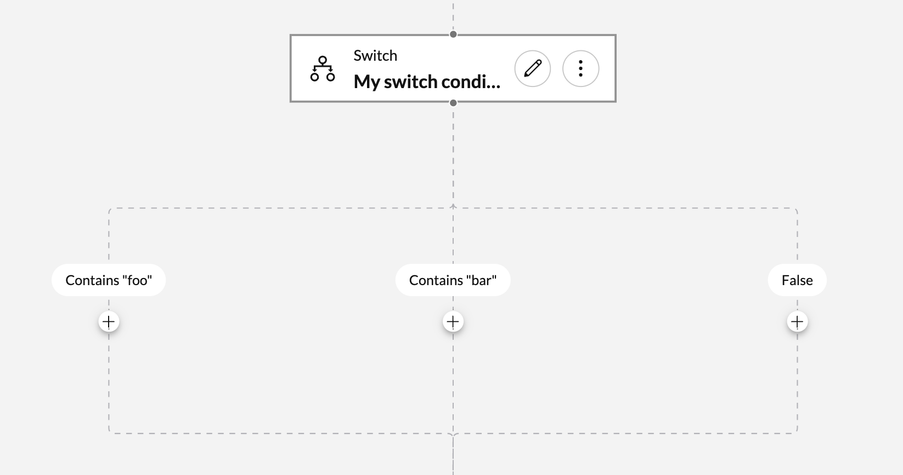
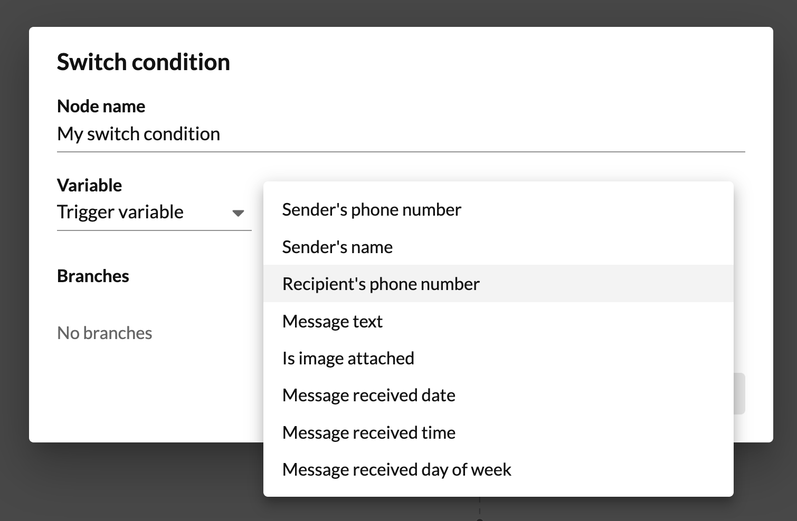

# Controlling the flow of an automation

Conditional and switch nodes within an automation provide users with a way of forking the flow of their automation based upon a set of rules they define. For example, you may wish to send different SMS messages to someone contacting based upon their area code, or some other criteria. To create logic like this, one must first add a conditional node to their automation, and then populate the different paths of that conditional node with the actions they want to execute within that logical pathway. 

There is no limit on the number of conditions a workflow can contain, and conditions can be nested as well, allowing for the formulation of more complex logical pathways. 

## Using variables to control the flow of an automation

You may find when defining the conditions of a conditional node different types of varibales around which a rule can be built. These types are utilized to help users in finding the right variable to test. These variable types are:

* **Trigger variables**. These variables related to the event that caused the automation to be executed. This may contain for example the phone number of the person who may have sent an SMS message that in turn triggered the automation.

* **User variables**. These variables relate to the person who owns the automation, or on whose behalf the automation is being run. This can be useful if you want to build a rule based upon whether or not the current user's status is set to "do not disturb."

* **Action variables**. These variables relate to the variables added to the automation in response to another action previously being executed. For example, you may wish to generate a transcription using an action, then respond different based upon the content's of that transcription. 

## Condition nodes, a.k.a. "if statements"

Automator's primary conditional node is a simple true/false, or boolean pathway. When this is added to your automation, two different pathways are established:

* One is when the conditions of the node are met (the "true" branch)
* One is when the conditions are NOT met (the "false" branch)

## Switch nodes

Switch nodes provide users with the way of selecting a single variable, and to generate any number of paths to follow based upon the value of that variable. Switch nodes are very powerful because they can be much more flexible in dealing with more complex decision trees, as more traditional condition nodes are restricted to testing a single condition: if this, then that.

You can see what a switch node looks like in our visual workflow designer below. 

<figure markdown>
  
  <figcaption>More experienced users can build custom workflows from scratch</figcaption>
</figure>

### Selecting the switch variable

When creating a switch node, the first thing you must do is select the variable that will be used in evaluated which branch or path the automation will follow. So step one, shown below, is about selecting this variable. 

<figure markdown>
  
  <figcaption>More experienced users can build custom workflows from scratch</figcaption>
</figure>

### Adding switch branches

Once you select the variable, you can click the "Add branch" button to add as many logical paths or branches that can stem from the value of this one variable. One really good use case for this is in writing different responses to incoming text messages. For example:

* If the incoming SMS message has "directions" in it, send a link to Google Maps. 
* If the incoming SMS message has "hours" in it, send our office hours.
* If the incoming SMS message has "sales" in it, alert our sales staff about a new lead. 
* If the incoming SMS message has "help" or "support" in it, send a link to our contact us page. 
* Otherwise, a.k.a. "else," do this other thing. 

The above scenario illustrates how a single switch statement can power a relatively complex SMS auto-reply system. 

<figure markdown>
  
  <figcaption>More experienced users can build custom workflows from scratch</figcaption>
</figure>
